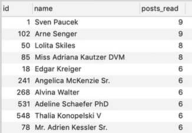

# MYSQL Practical examples

### Fetch the Most Popular Authors
```mysql
SELECT users.id, users.name, COUNT(*) post_read FROM users
    LEFT JOIN post_reads
        ON post_reads.post_id IN (
            SELECT id FROM posts WHERE user_id = users.id
        )
GROUP BY users.id
ORDER BY posts_read DESC
LIMIT 10;
```


### Determine the Average Rentals Per Day
```mysql
SELECT ROUND(AVG(total_rentals)) average_rent
FROM (
    SELECT date(rental_date) day, count(*) total_rentals FROM rental
    GROUP BY dAY
    ORDER BY DAY DESC
) rentals;
```
